# 高统
#### 5/11/2024 Linxi(LiLinxi) 2024 Gaotong
#### Reference:2020YangChengYu
#### https://github.com/EternityQAQ2/DLUT_2024_GaoTong
RSS（残差平方和）、RSE（残差标准误）和MSE（均方误差）
$$
RSS = \sum_{i=1}^n (Y_i - \hat{Y}_i)^2
$$
$$
MSE = \frac{RSS}{n - p}
$$
$$
RSE = \sqrt{MSE} = \sqrt{\frac{RSS}{n - p}}
$$


##  第二章 统计学习
###  什么是统计学习

**输入变量**通常用 **X** 表示，也称为**预测变量**、**自变量**、**属性变量**

**输出变量**通常用 **Y** 表示，也称为**响应变量**、**因变量**
$$
Y = f(X) + ε
$$
f是X的函数，固定但未知，f表达了X提供给Y的系统信息，ε是**随机误差项**（与X独立，均值为0）

####   什么情况下需要估计f

**预测**和**推断**。

##### 预测

预测主要关心f的估计值的准确性，不关注其是如何预测的（将f当作黑箱）

精确性包括**可约误差**与**不可约误差**，可约误差可以通过选择更合适的统计学习方法降低

##### 推断

推断主要关心$X_1$,$X_2$,...变化时如何对Y产生影响（不能将f当作黑箱）

#### 如何估计f

估计任务大多可分为**参数方法**和**非参数方法**
非参数方法的关键特点是：这些方法不假定特定的概率分布或数据模型形式。换句话说，非参数方法不预设数据生成过程的具体数学形式，而是通过数据本身来揭示变量之间的关系。
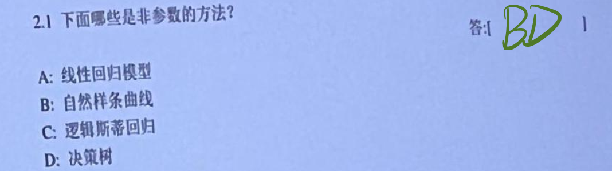
自然样条曲线并不假设数据符合某种特定的函数形式（如线性或多项式），而是通过分段多项式和节点（knots）来灵活拟合数据。这是非参数特性。
回归树不需要预先设定任何特定的模型形式，而是通过数据驱动的方式划分输入空间。
##### 非参数方法的共同特征
模型灵活：无需预设具体的函数形式，模型复杂度与数据量相关。
数据驱动：模型结构直接依赖于数据，增加数据量可以改善模型表现。
适用性广：能处理更广泛的数据分布和非线性关系。
##### 参数方法

假设函数f具有一定的形式，用训练数据集去拟合模型（估计参数），即把估计f的问题简化到估计一组参数

> 过拟合：拟合了错误或噪声

##### 非参数方法

不对函数f的形式做明确的假设，追求尽可能接近数据点

（薄板样条）

#### 预测精度和模型解释性的权衡

一般来说，当一种方法的光滑度增强时，其解释性减弱

####  指导学习和无指导学习

指导学习：数据集中有对应的响应变量来指导数据分析

> 逻辑斯蒂回归、支持向量机

无指导学习：数据集缺乏一个响应变量来指导数据分析

> 聚类分析

半指导学习：部分有，部分没有

####  回归与分类问题

变量常分为**定量**和**定性**两种类型。响应变量定量是回归问题，响应变量定性则是分类问题


###   评价模型精度

#### 拟合效果检验

常用的评价准则是**均方误差**（mean squared error, **MSE**）
$$
MSE = \frac{1}{n}\sum_{i=1}^{n}(y_i-\hat{f}(x_i))^2
$$
$$
MSE = \frac{1}{n}*RSS
$$
我们的目标是使模型的测试均方误差最低

当模型的光滑度增加时，训练均方误差降低，但是测试均方误差不一定降低

> 当模型有较小的训练均方误差，但是有较大的测试均方误差时，称为过拟合
>
> 降低模型的光滑度可以减小测试均方误差

##### 自由度

自由度是**描述曲线光滑程度**的正式术语

#### 偏差-方差权衡

$$
E(y_0-\hat{f}(x_0))^2=Var(\hat{f}(x_0))+[Bias(\hat{f}(x_0))]^2+Var(ε)
$$

> 测试均方误差的期望能分解为：预测值$\hat{f}(x_0)$的方差、预测值$\hat{f}(x_0)$的偏差的平方、误差项ε的方差

因此我们需要得到一个偏差和方差综合起来最小的模型

##### 偏差

偏差（bias）指的是为了选择一个简单的模型逼近真实函数而被带入的误差

##### 方差

方差（variance）代表的是用一个不同的训练数据集估计f时，估计函数的改变量

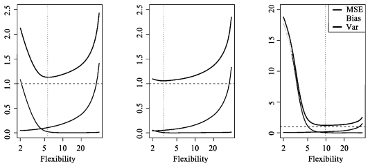
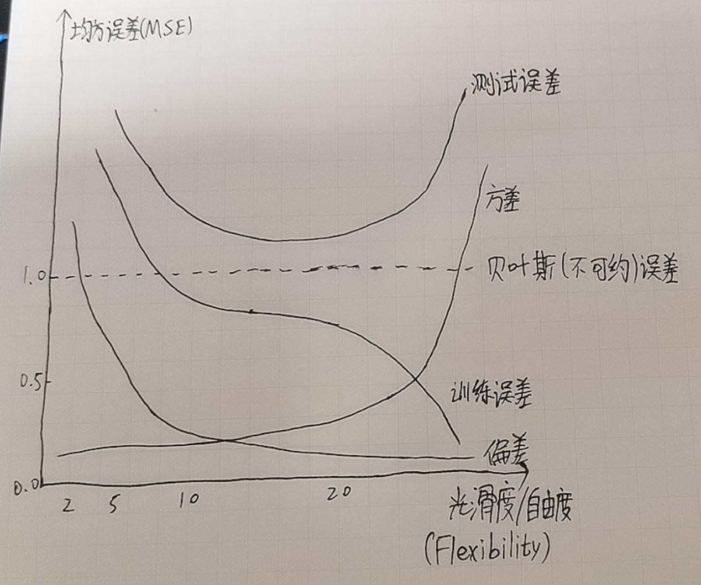

如果一个统计学习模型被称为测试性能好，则要求该模型有较小的方差和较小的偏差
**一般而言，使用光滑度更高的方法，所得的模型方差会增加，偏差会减小。**

####  分类模型
训练错误率如下公式
$$
\frac{1}{n}\sum_{i=1}^{n}I(yi\neq \hat yi)
$$
测试错误率如下公式，
$$
Ave(I(y0 \neq \hat y0))
$$

贝叶斯分类器
KNN
k 的选择对获得 KNN 分类器有根本性的影响。当 K= 1 时，决策边界很不规则，从数据中拟合的模型不能与贝叶斯决策边界完全契合。这个分类器虽然偏差较低但方差很大。当 K 增加时，模型的光滑性减弱，得到一个接近线性的决策边界。
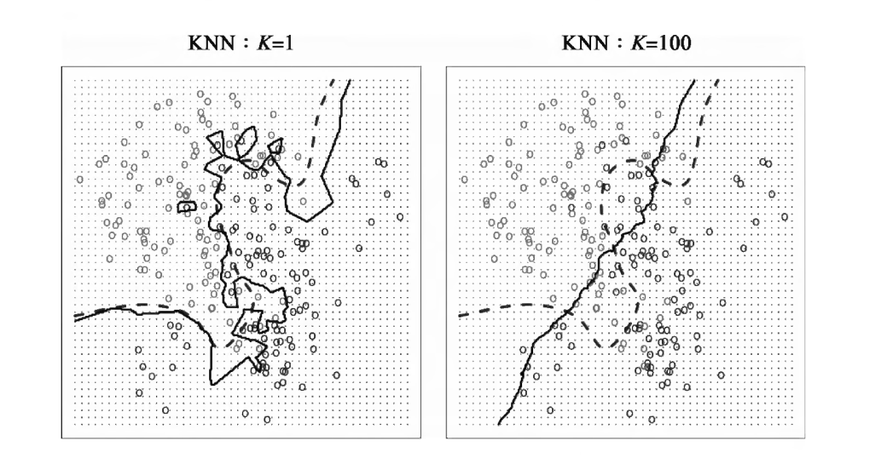

---

##  第三章 线性模型


线性回归是一种统计方法，用于研究两个或多个变量之间的线性关系。根据变量数量的不同，可以分为简单线性回归和多元线性回归。


###  简单线性回归

####  定义
简单线性回归用于研究两个变量之间的线性关系，其中一个是**自变量**（`X`），另一个是**因变量**（`Y`）。其数学模型表示为：
$$
Y = \beta_0 + \beta_1X + \epsilon
$$
- $\beta_0$：截距，表示当`X=0`时`Y`的预测值。
- $\beta_1$：斜率，表示`X`每增加一个单位时，`Y`的平均变化量。
- $\epsilon$：随机误差。

####  目标
通过最小化 **残差平方和（RSS）** 来估计参数 $\beta_0$ 和 $\beta_1$：
$$
RSS = \sum_{i=1}^n (Y_i - (\beta_0 + \beta_1X_i))^2
$$
####  标准误差和置信区间
在线性回归模型中，回归系数 $\beta_1$ 的置信区间用于估计其真实值可能的范围，基于其估计值 $\hat{\beta}_1$ 和标准误差 $SE(\hat{\beta}_1)$。
$\beta_1$ 的标准误差公式如下：
$$
SE(\hat{\beta}_1) = \sqrt{\frac{\hat{\sigma}^2}{\sum_{i=1}^n (X_i - \bar{X})^2}}
$$
对于线性回归模型，$\beta_1$的置信区间如下：
$$
\hat \beta_1 \pm 2 *SE(\hat \beta_1)
$$
#### 假设
1. 自变量和因变量之间存在线性关系。
2. 残差的期望为零，即 $E(\epsilon) = 0$。
3. 残差方差恒定（同方差性）。
4. 残差独立。
5. 残差服从正态分布（通常用于推断）。

---

###  多元线性回归

####  定义
多元线性回归扩展了简单线性回归，用于研究多个自变量（`X1, X2, ..., Xp`）与因变量`Y`之间的线性关系。其数学模型为：
$$
Y = \beta_0 + \beta_1X_1 + \beta_2X_2 + \cdots + \beta_pX_p + \epsilon
$$

- $\beta_0$：截距，表示所有自变量为0时`Y`的预测值。
- $\beta_1, \beta_2, \dots, \beta_p$：各自变量的回归系数，表示该自变量对因变量的影响（假设其他变量保持不变）。

#### 目标
通过最小化残差平方和来估计参数：
$$
RSS = \sum_{i=1}^n \left( Y_i - \left( \beta_0 + \sum_{j=1}^p \beta_jX_{ij} \right) \right)^2
$$

####  假设
与简单线性回归相同，但需要针对多变量：
1. 自变量与因变量之间的关系是线性的。
2. 各个自变量之间无高度共线性。
3. 残差的期望为零，方差恒定，独立且服从正态分布。

### 评估模型参数
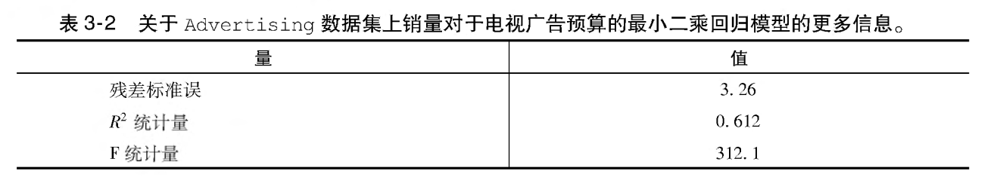
$$
RSE = \sqrt{\hat{\sigma}^2} = \sqrt{\frac{1}{n - p - 1} \sum_{i=1}^n (Y_i - \hat{Y}_i)^2}
$$
$$
R^2 = 1 - \frac{\sum_{i=1}^n (Y_i - \hat{Y}_i)^2}{\sum_{i=1}^n (Y_i - \bar{Y})^2} = 1-\frac{RSS}{TSS}
$$
$$
F = \frac{\frac{\text{Explained Variance}}{p}}{\frac{\text{Unexplained Variance}}{n - p - 1}} = \frac{\frac{TSS - RSS}{p}}{\frac{RSS}{n - p - 1}}
$$
RSE越小、$R^2$越大，F越小，结果越好。

###  回归模型的其他问题
####  数据的非线性
残差图( residual plot) 是一种很有用的图形工具，可用于识别非线性。给定一个简单线性回归模型，我们就可以绘制残差 $ ei = Yi - Yi $ 和预测变量 X i 的散点图。在多元回归中，因为有多个预测变量，我们转而绘制残差与预测值(或拟合值 ( fitted)) Yi 的散点图。**理想情况下，残差图显示不出明显的规律。若存在明显规律，则表示线性模型的某些方面可能有问题。**

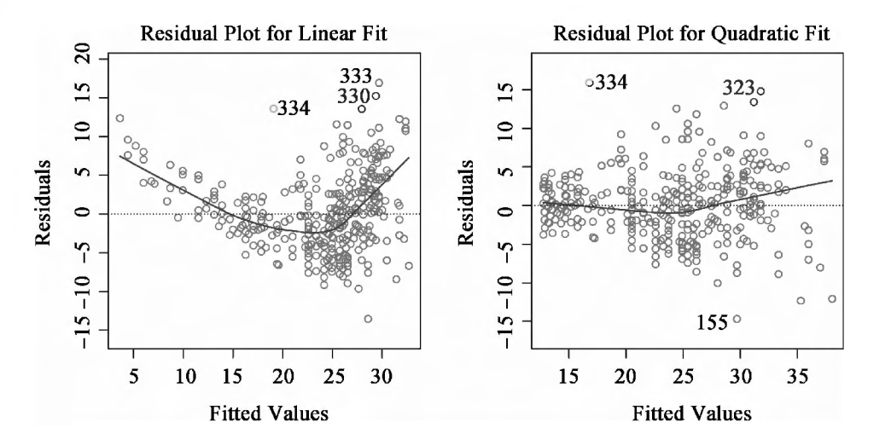
####   误差项自相关
线性回归模型的一个重要假设是误差项𝜀_1,𝜀_2,… 𝜀_𝑛不相关。如果误差项相关，那么估计标准误往往低估了真实标准误，因此，置信区间和预测区间比真实区间窄。例如95%置信区间包含真实参数的实际概率将远低于0.95。这可能导致得出错误的结论。
####   误差项方差非恒定
线性回归模型的另一个重要假设是误差项的方差是恒定的$ VAR(𝜀_𝑖)=𝜎^2$。假设检验和标准误差、置信区间计算依赖这一假设。
但通常，误差项的方差不是恒定的。例如，误差项的方差可能会随响应值的增加而增加。如果残差图呈漏斗形，说明误差项方差非恒定或存在异方差性。
下左图，残差随拟合值增加而增加。
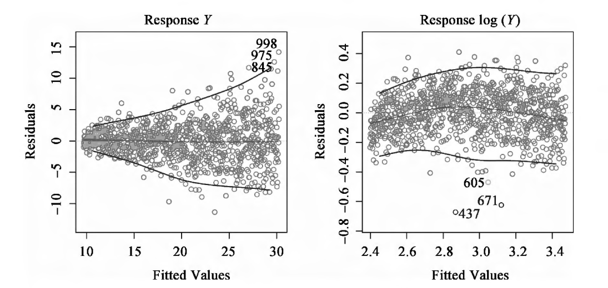

####  离群点
离群点(outlier) 是指 Yi 远离模型预测值的点。
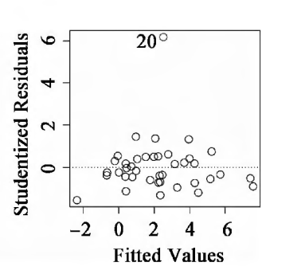

####  高杠杆点
高杠杆(high leverage)表示观测点Xi是异常的。
####   R语言 Residuals vs Leverage 图
横轴（Leverage）：表示杠杆值，衡量每个样本对模型拟合的影响。高杠杆点靠近图的右侧。
纵轴（Residuals）：表示标准化残差，衡量实际值与预测值的差异。
Cook’s Distance：用虚线表示，用于综合评估点对模型的影响力。

##### 离群点：
通常出现在图的**上部或下部**，残差值明显大于其他点（高出或低于 2 或 3 的范围）。
这些点虽然对模型的影响力可能不大，但反映了模型在预测这些点时的误差较大。
##### 高杠杆点：
横轴位置靠右，杠杆值较高。这些点的 Cook’s Distance 较大，可能显著影响模型参数。
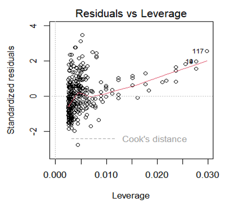
117是高杠杆点，纵坐标大于2的是离群点。

#### 共线性
共线性是指两个或更多的预测变量高度相关。如下图Credit数据集（右图），它会导致难以分离单个变量对响应值的影响。
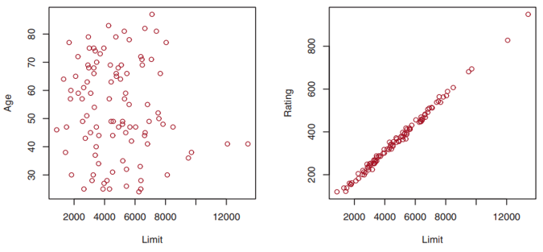
检测共线性的一个简单方法是看预测变量的相关系数矩阵。但即使没有某对变量具有特别高的相关性，有可能三个或更多变量之间存在共线性，成为多重共线性。
更好的方法是计算方差膨胀引子（VIF），VIF是拟合全模型时的系数(𝛽_𝑗 ) ̂的方差除以单变量回归中(𝛽_𝑗 ) ̂的方差所得的比例。VIF最小可能值是1，表示完全不存在共线性。通常情况，VIF值超过5或10就表示有共线性问题。
####  线性回归与K最近邻法的比较 维度灾难。
预测效果随着维数的增加而恶化是KNN一个普遍问题，因为在高维中样本量大大减少。下图有100个训练观察，当p=1时，这些点提供了足够的信息来准确估计f(X)。然而，当这100个观测值分布在p=20个维度上时，将使给定的观测附近没有邻点——即	若每个预测变量仅有少量观测，参数化方法往往优于非参数方法。
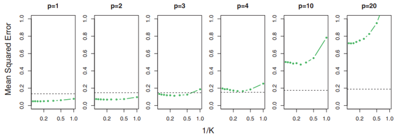


##  第四章 分类

### 逻辑斯蒂回归
#### 概述
逻辑斯蒂回归是一种广泛使用的线性分类模型，用于预测二分类或多分类问题的结果。其核心思想是通过 **逻辑函数 (logistic function)** 将线性回归的预测值映射到 [0, 1] 区间，从而得到分类概率。
#### 数学表达
$$
\log\left(\frac{P}{1-P}\right) = z
$$
其中：
- \( P \) 是事件发生的概率。
- \( 1-P \) 是事件不发生的概率。
- \( z = w^T x + b \)，表示线性模型的输出。
### 线性判别分析
####  概述
线性判别分析是一种经典的降维与分类方法，常用于将高维数据投影到低维空间，同时保持类别的可分性。LDA的核心思想是通过最大化类间散布与类内散布的比值，以找到数据最优的分割方向。
#### 核心思想
LDA的目标是找到一个线性变换矩阵 \( W \)，使得投影后的数据在类间的距离最大化，同时类内的距离最小化。
LDA的目的是将高维特征投影到一个低维子空间中同时保持类间的良好可分性和类内的最大化方差。
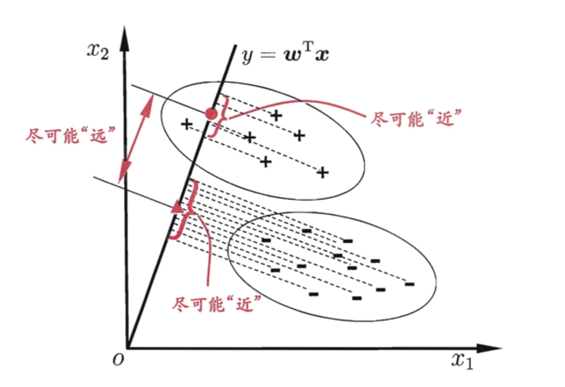

#### ROC曲线
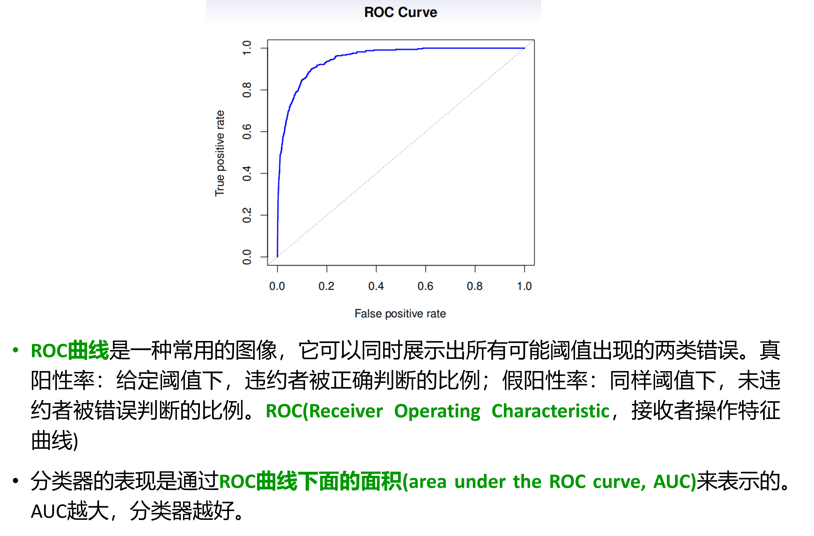
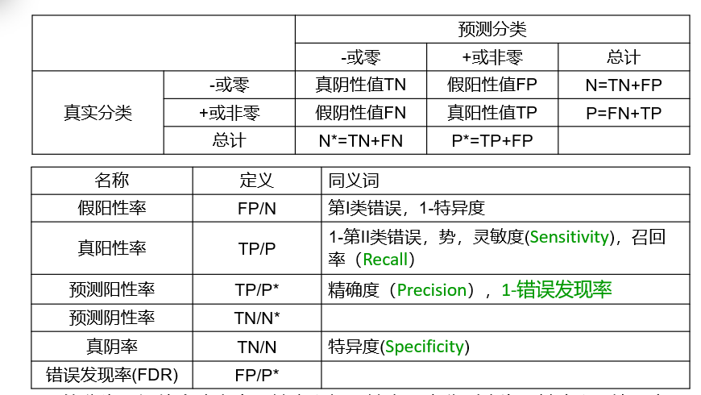

### 二次判别分析
如果假设服从多元高斯分布，但每一类观测都有自己的协方差矩阵，则称作二次判别分析(quadratic discriminant analysis, QDA)
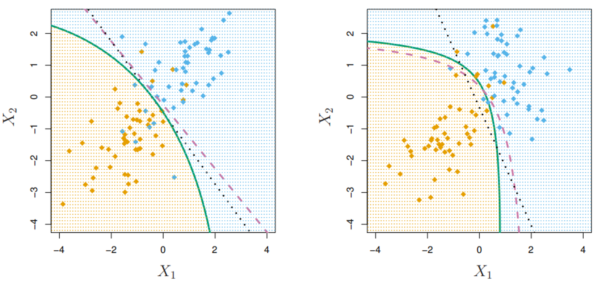
贝叶斯（紫色虚钱）、LDA（黑色点钱）、QDA（绿色实钱）

### 方法比较
逻辑斯谛回归中参数是由极大似然估计出来的
LDA是通过估计的正态分布均值和方差计算出来的
所以两者得到的结果应该是接近的。但LDA假设观测服从每一类协方都相同的高斯分布，当假设成立时，LDA能提供更好的结果

> 将一个数据集分成大小相同的训练集和测试集，尝试两种不同的分类过程。首先应用逻辑斯谛回归，在训练集上得到错误率为 20%.在测试集上错误率为 30% 。其次应用 1 最近邻法 (K=1) ， 得到平均错误率{在训练集和测试袋上始平均)为 18%。基于这些结果，对新的观测应采取何种分类方法比较好?为什么?
> 	应用K=1的KNN经过训练集训练后，计算训练数据集上的准确度，我们会得到100%的准确率，原因是模型已经看到了这些值，并且为K=1形成了一个粗略的决策边界。这意味着本题K=1的KNN在训练集上的错误率为0%，而在测试集上的错误率为36%。而逻辑斯蒂回归在测试集上的错误率为30%，比36%低一些，故选择逻辑斯蒂回归分类方法。

## 第五章 重抽样方法


引入的目的：为了估计测试误差

基本方法：将可用的样本随机分为**训练集**和**测试集**

定量的响应应使用均方误差估计，定性的响应应使用误分类率评估


### 交叉验证法

#### 验证集方法

直接随机将数据集分为训练集和测试集两部分

##### 优点

- 计算简便
- 可解释性较好

##### 缺点

- 测试错误率的验证法的估计波动大，取决于具体哪些观测包含在训练集/验证集中
- 只有一个子集被用来拟合模型，验证集的错误率可能会高估在整个数据集上拟合模型的测试误差

#### 留一交叉验证（LOOCV）

选一个观测作为测试集，剩下n-1个观测作为训练集，训练并测试，得到这个观测的均方误差MSE

重复这个步骤n次，得到n个MSE，然后使用如下公式计算平均的MSE
$$
CV_{(n)}=\frac{1}{n}\sum_{i=1}^{n}MSE_i
$$


#### K折交叉验证

将观测机随机分为k个大小基本一致的组，每次选一个组作为测试集，剩下k-1个组作为训练集，训练并测试，得到这个测试集的均方误差MSE

重复这个步骤k次，得到n个MSE，然后同样进行平均计算

##### 优点

- 相较LOOCV，方差更低
- 相较LOOCV，计算更简便

##### 缺点

- 相较LOOCV，偏差更高
- 相较LOOCV，存在分割的随机性，LOOCV不存在这个问题

##### K折交叉验证的偏差-方差权衡

K减小，偏差减小方差增大；K增大，方差减小偏差增大


### 自助法

用途：用来衡量一个指定的估计量，比如估计线性回归模型中系数的标准误差

随机从数据集中选择n个观测（有放回的抽样），组成一个自助法数据集$Z^{·1}$，使用这个数据集对α进行自助法估计，得到$\hat{α}^{·1}$

重复B次（B是一个很大的值），得到B个对应的估计$\hat{α}^{·1},...,\hat{α}^{·B}$，然后通过公式能计算这些自助法估计的标准误差
$$
SE_B(\hat{α})=\sqrt{\frac{1}{B-1}\sum_{r=1}^{B}(\hat{α}^{·r}-\frac{1}{B}\sum_{r^{'}=1}^{B}\hat{α}^{·r^{'}})^2}
$$


#### 自助法的其他用途

- 主要用于得到估计的标准误差
- 还提供了总体参数的近似置信区间


#### 自助法不能估计测试误差的原因

- k折交叉验证中，每一折中的k-1训练集和验证集都不重叠
- 使用自助法估计测试误差，假如使用每个抽样的样本作为训练样本，原始样本作为验证样本，发现每个抽样样本和原始样本有显著的重叠（约三分之二），导致其严重低估真实的测试误差


### 方法比较
| 特性                | 自助法                         | 交叉验证                      | 验证集法                  |
|---------------------|-------------------------------|-------------------------------|---------------------------|
| **数据利用率**     | 每次生成的样本约63.2%数据被训练用，多次重采样覆盖全部数据。 | 每次仅用部分数据作为测试集，其余数据用于训练。 | 留出一部分数据做验证集，浪费部分数据。 |
| **评估可靠性**     | 稍逊，因生成的样本可能失真。     | 更可靠，因所有数据都参与训练和测试。 | 结果可能因划分随机性不稳定。 |
| **计算成本**       | 低，每次只需生成样本并训练一个模型。 | 高，需要多次训练模型并测试。   | 较低，只需训练一个模型并测试一次。 |
| **适用场景**       | 数据量较小时，尤其适合。         | 需要更可靠评估时适用，尤其是数据量较小。 | 数据量较大时快速评估。     |
| **是否浪费数据**   | 否，所有数据多次被利用。         | 否，所有数据都被用到。         | 是，验证集不参与训练。     |


## 第六章 线性模型选择与正则化


采用其他拟合方法替代最小二乘法的原因：其他方法有**更高的预测准确率**，**更好的模型解释力**

**预测准确率**

- 不满足n远大于p，则最小二乘可能过拟合
- 若p>n，最小二乘得到的系数估计结果不唯一，此时方差无穷大，无法使用最小二乘

<u>改进：通过**限制**或**缩减**待估计系数，牺牲偏差的同时显著减小估计量方差</u>

**模型解释力**

- 多元回归模型中，常存在多个变量与响应变量不存在线性关系的情况，增加复杂度却与模型无关
- 去除不相关特征可以得到更容易解释的模型，而最小二乘很难将系数置为0

<u>改进：通过自动进行**特征选择**或**变量选择**，实现对无关变量的筛选</u>

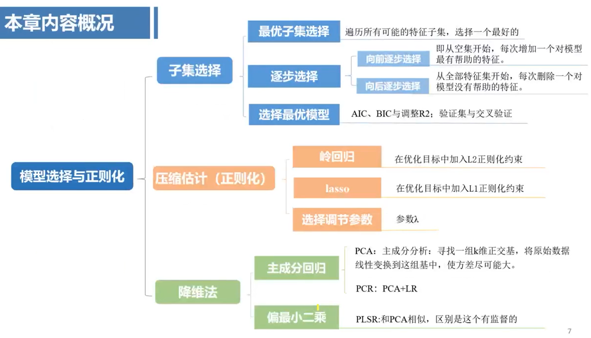


### 子集选择

#### 最优子集选择

对于k=1,2,...,p: 拟合$C_p^k$个包含k个预测变量的模型，并且在这$C_p^k$个模型中选择RSS最小或$R^2$最大的模型

然后根据交叉验证预测误差、$C^p(AIC)$、$BIC$或调整$R^2$从这些模型中选一个最优模型

- 缺陷明显：p比较大时不具有计算可行性


#### 逐步选择

逐步选择包括**向前逐步选择**和**向后逐步选择**

##### 向前逐步选择

对于k=1,2,...,p: 从p-k个模型中选择（在前一个模型基础上增加一个变量），并且在这p-k个模型中选择RSS最小或$R^2$最大的模型

然后根据交叉验证预测误差、$C^p(AIC)$、$BIC$或调整$R^2$从这些模型中选一个最优模型

##### 后向逐步选择

对于k=p,p-1,...,1: 从k个模型中选择（在前一个模型基础上减少一个变量），并且在这p-k个模型中选择RSS最小或$R^2$最大的模型

然后根据交叉验证预测误差、$C^p(AIC)$、$BIC$或调整$R^2$从这些模型中选一个最优模型


#### 选择最优模型的指标

$C_p$、$AIC$、$BIC$和调整$R^2$
$$
C_p=\frac{1}{n}(RSS+2d\hat{σ}^2)
$$

$$
AIC=\frac{1}{n\hat{σ}^2}(RSS+2d\hat{σ}^2)
$$

$$
BIC=\frac{1}{n}(RSS+log(n)d\hat{σ}^2)
$$

$$
调整R^2=1-\frac{RSS/(n-d-1)}{TSS/(n-1)}
$$

### 压缩估计方法

####  岭回归（L2正则化）

与最小二乘相似，但增加了压缩惩罚
$$
\sum_{i=1}^{n}(y_i-β_0-\sum_{j=1}^{p}β_jx_{ij})^2+λ\sum_{j=1}^{p}β_j^2=RSS+λ\sum_{j=1}^{p}β_j^2
$$
λ≥0是调节参数，λ越小光滑度越高，偏差越小方差越大

※ 使用岭回归之前最好先对预测变量进行标准化


#### Lasso（L1正则化）

$$
\sum_{i=1}^{n}(y_i-β_0-\sum_{j=1}^{p}β_jx_{ij})^2+λ\sum_{j=1}^{p}|β_j|=RSS+λ\sum_{j=1}^{p}|β_j|
$$

λ≥0是调节参数，λ越小光滑度越高，偏差越小方差越大


#### 岭回归和Lasso的等价问题

Lasso回归等价于求解
$$
\mathop{minimize}\limits_{β}\{\sum_{i=1}^{n}(y_i-β_0-\sum_{j=1}^{p}β_ix_{ij})^2\},\sum_{j=1}^{p}|β_j|≤s
$$
岭回归等价于求解
$$
\mathop{minimize}\limits_{β}\{\sum_{i=1}^{n}(y_i-β_0-\sum_{j=1}^{p}β_ix_{ij})^2\},\sum_{j=1}^{p}β_j^2≤s
$$


将上式数形结合表示如图，黑色区域为≤s的区域，椭圆是RSS等高线


#### 岭回归和Lasso的贝叶斯解释

岭回归对应高斯分布的密度函数

Lasso对应拉普拉斯分布的密度函数


### 降维方法

#### 主成分回归（PCA）

见第十章


#### 偏最小二乘（PLS）

偏最小二乘用响应变量Y的信息筛选新变量

#### PCA 和 PLS 区别
| **属性**            | **PCA（主成分分析）**                     | **PLS（偏最小二乘法）**               |
|---------------------|------------------------------------------|---------------------------------------|
| **学习类型**        | 无监督学习                               | 监督学习                              |
| **输入数据**        | 仅 \( X \)                               | \( X \) 和 \( Y \)                   |
| **目标**            | 最大化 \( X \) 的方差                    | 同时解释 \( X \) 的方差和 \( X \)-\( Y \) 的关系 |
| **投影方向**        | 基于 \( X \) 的协方差矩阵                | 基于 \( X \) 和 \( Y \) 的协方差矩阵 |
| **应用场景**        | 数据降维、压缩、去噪                     | 回归、预测、多变量分析               |
| **输出结果**        | 与 \( Y \) 无关的降维特征                | 与 \( Y \) 强相关的降维特征          |


### 高维数据的回归问题

拟合并不光滑的最小二乘模型在高维中作用很大：

- 正则或压缩在高维问题中至关重要
- 合适的调节参数对于得到好的预测非常关键
- 测试误差会随着数据维度的增加而增大，除非新增特征变量与响应变量确实相关


## 第七章 非线性模型


### 多项式回归


$$
y=β_0+β_1x_i+β_2x_i^2+β_3x_i^3+...+β_dx_i^d+ε_i
$$


### 阶梯函数

创建分割点$c_1,c_2,...,c_K$，然后构造K+1个新变量：$C_0(X)=I(X<c_1),...,C_K(X)=I(c_k≤X)$
$$
y_i=β_0+β_1C_1(x_i)+β_2C_2(x_i)+...+β_KC_K(x_i)+ε_i
$$

### 基函数

多项式和阶梯函数回归模型实际上是特殊的基函数方法，对变量X的函数变换$b_1(X),b_2(X),...,b_K(X)$进行建模
$$
y_i=β_0+β_1b_1(x_i)+β_2b_2(x_i)+...+β_Kb_K(x_i)+ε_i
$$


### 回归样条

不同区域拟合不同的多项式函数，可以这样表示

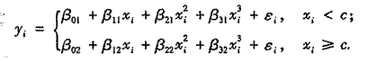

没有约束的有K个结点的三次样条会产生4K+4个自由度

有K个结点的三次样条会产生K+4个自由度（原因是每个结点处增加了三个约束：连续、一阶导连续、二阶导连续）

同时也可以使用样条基函数表示
$$
y_i=β_0+β_1b_1(x_i)+β_2b_2(x_i)+...+β_{K+3}b_{K+3}(x_i)+ε_i
$$


#### 截断幂基

在上述基函数式子中，可以选择不同的基函数得到等价的三次样条，比如截断幂基的方式是先以三次多项式的基为基础（$x,x_2,x_3$），然后在每个结点添加一个截断幂基函数

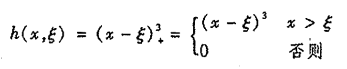

其中ξ是结点


#### 确定结点的个数和位置

使用交叉验证确定：首先移除10%的数据，用剩余的数据拟合，然后对那部分被移除的数据进行预测（10折交叉验证），最后计算整体的交叉验证RSS。整个过程对不同的结点数K不断尝试


回归样条通常结果比多项式回归好且稳定，回归样条通过固定自由度但是多设立结点的方式来获得稳定的估计结果

### 光滑样条

如果对$g(x_i)$不添加任何约束条件，只能得到一个取值为0的RSS，这样的函数对数据严重过拟合。而实际上真正需要的g是满足RSS尽量小，同时曲线尽量平滑（较少的突变，光滑度下降）

可以通过最小化下式
$$
\sum_{i=1}^{n}(y_i-g(x_i))^2+λ\int g''(t)^2dt
$$
λ由0增至∞，实际自由度$df_{λ}$从n降至2

### 局部回归

选取s=k/n比例的最靠近$x_0$的数据$x_i$

对选出的数据赋予其权重$K_{i0}=K(x_i,x_0)$，离$x_0$最远的点权重为0，而最近的点权重最高

用定义好的权重在$x_i$处拟合加权最小二乘回归

根据$\hat{f}(x_0)=\hat{β}_0+\hat{β}_1x_0$得到$x_0$的拟合结果


### 广义可加模型

每一个变量用一个非线性函数替换
$$
y_i=β_0+f_1(x_{i1})+f_2(x_{i2})+...+f_p(x_{ip})+ε_i
$$

#### GAM的优点与不足

- 允许每一个$X_i$都拟合一个非线性$f_i$，非线性拟合模型能预测得更精准，且模型可加，能保持其他变量不变情况下观测单变量对Y的影响效果

- 局限在于形式被限定为可加形式

#### 用于分类的GAM

用逻辑斯蒂回归的对数发生比即可
$$
log(\frac{p(X)}{1-p(X)})=β_0+f_1(X_1)+f_2(X_2)+...+f_p(X_p)
$$

$$
p(X)=Pr(y>n|f_1(X),f_2(X),f_3(X)...)
$$


## 第八章 基于树的方法


### 决策树基本概念

#### 回归树

建立回归树的步骤：

1.将预测变量空间（X1...Xp可能取值的集合）分为J个互不重叠的区域R1...Rj

2.对落入Rj的每个观测值作同样的预测，预测值等于Rj上训练集响应值的算术平均，如果是分类树，则分类为该区域最多的那类

计算决策树模型的RSS：
$$
\sum_{j=1}^{J}\sum_{i∈Rj}(y_i-\hat{y}_{R_j})^2
$$

#### 分类树

分类树与回归树类似，但是评判标注不能使用RSS，改为分类错误率、基尼系数和互熵

分类错误率（classification error rate）
$$
E=1-\mathop{max}\limits_{p}(\hat{p}_{mk})
$$
基尼系数（Gini index）
$$
G=\sum_{k=1}^{K}\hat{p}_{mk}(1-\hat{p}_{mk})
$$
如果它较小，就意味着某个结点包含的观棋i值几乎都来自同一类别。
互熵（cross-entropy）
$$
D=-\sum_{k=1}^{K}\hat{p}_{mk}log\hat{p}_{mk}
$$
与基尼系数类似，如果第 m 个结点纯度较高(数据平均地来自不同类别)，则互熵值较小。

#### 分类指标
> 在一个仅有两个类别的简单分类情况下考虑基尼系数、分类误差和互熵。创建一张图，将这几个量分别表示为pm1的函数。
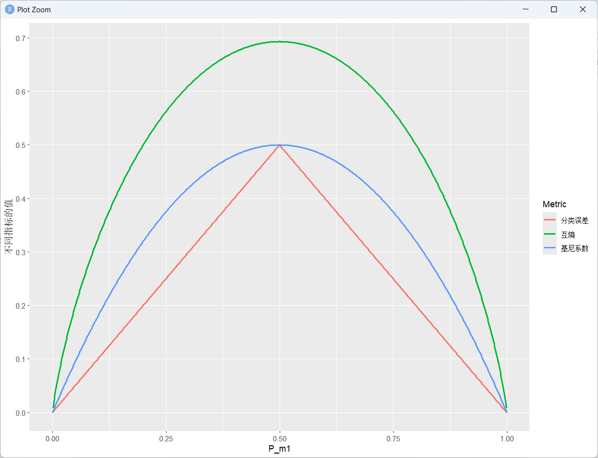

### 树的剪枝

上述方法在训练集取得良好预测效果，但是可能造成过拟合，更好的策略是生成一个很大的树$T_0$，然后通过剪枝得到子树

剪枝的目的是选出使测试集预测误差最小的子树

**代价复杂性剪枝**也称**最弱联系剪枝**，不考虑每一棵可能的子树，而是考虑以非负调整参数α标记的一系列子树，每一个α的取值对应一棵子树$T⊂T_0$，当α一定时，其对应的子树使下式最小
$$
\sum_{m=1}^{|T|}\sum_{x_i∈Rm}(y_i-\hat{y}_{R_m})^2+α|T|
$$
$|T|$表示终端结点数，调整系数α在子树的复杂性与训练数据的契合度之间控制权衡，α增大：模型的偏差变大方差变小

剪枝过程：

```
(1)利用递归二叉分裂在训练集中生成一颗大树，只有当终端结点包含的观测值个数低于某个最小值时才停止
(2)对大树进行代价复杂性剪技，得到一系列最优子树，子树是α的函数
(3)利用K折交叉验证选择α。具体做法是将训练集分为K折。对所有k=1,...,K，有:
	(a)对训练集上所有不属于第K折的数据重复步骤1和2，得到与α一一对应的子树
	(b)求出上述子树在第k折上的均方预测误差
	上述操作结束后，每个α会有相应的K个均方预测误差，对这K个值求平均，选出使平均误差最小的α
(4)找出选定的α值在步骤2中对应的子树中即可
```


### 决策树评估

#### 树与线性模型的比较

线性回归假设了如下模型形式：
$$
f(X)=β_0+\sum_{j=1}^{P}X_jβ_j
$$
回归树的模型形式为：
$$
f(X)=\sum_{m=1}^{M}c_m*1_{(X∈R_m)}
$$
真实模型线性时，线性模型更好；真实模型复杂且高度非线性时，树方法更好


#### 树的优缺点
优点：
- 解释性强，比线性回归更好解释
- 更接近人的决策模式
- 可以使用图形表示，非专业人士轻松解释
- 可以直接处理定性的预测变量而不需创建哑变量


缺点：
- 预测准确率一般低于其他回归和分类方法的水平


### 装袋法、随机森林和提升法

#### 装袋法

##### 基本概念

基本思想/目的：对一组观测求平均可以减小方差

从总体中抽取多个训练集，对每个训练集分别建立预测模型，再对由此得到的多个预测值求平均
$$
\hat{f}_{avg}(x)=\frac{1}{B}\sum_{b=1}^{B}\hat{f}^b(x)
$$
求平均的具体方法：多数投票（majority vote），将B个预测中出现频率最高的类作为总体预测

##### 袋外误差估计

平均每棵树能利用约三分之二的观测值，剩余三分之一没有使用的观测称为此树的袋外（out-of-bag，OOB）观测值

可以用所有将第i个观测值作为OOB的树来预测第i个观测值的响应值，则有B/3个对第i个观测值的预测，对这些值计算总体的OOB均方误差（对回归问题）或分类误差（对分类问题），由此得到的OOB误差是对装袋法模型测试误差的有效估计

##### 变量重要性

对基尼系数平均减小值最多的变量


#### 随机森林

##### 基本概念

基本思想/目的：根分裂结点基本上都是最重要的预测变量，导致装袋法中抽取的树高度相关。故每次分裂点随机取变量，对树作去相关处理，降低模型方差

每次考虑树上的一个分裂点，从全部的p个变量中随机（每次都随机）选m个，作为候选变量。这次的分裂点只能从这m个中挑选，通常$m≈\sqrt{p}$


#### 提升法

##### 基本概念

目的：降低学习率，舒缓的迭代，使模型预测效果变好

1.对训练集中的所有i，令$\hat{f}(x=0)$，$r_i=y_i$

2.对$b=1,2,...,B$重复以下过程

​	（a）对训练数据$(X,r)$建立一棵有d个分裂点的树$\hat{f}^b$

​	（b）将压缩后的新树加入模型以更新$\hat{f}$：
$$
\hat{f}(x)⬅\hat{f}(x)+λ\hat{f}^b(x)
$$
​	（c）更新残差：
$$
r_i⬅r_i-λ\hat{f}^b(x)
$$
3.输出经过提升的模型：
$$
\hat{f}(x)=\sum_{b=1}^{B}λ\hat{f}^b(x)
$$

##### 三个参数

（1）树的总数B：与装袋法和随机森林不同，B值过大可能过拟合，但是发展很缓慢，用交叉验证来选择B

（2）取极小正值的压缩参数λ：控制学习速度，常取0.01或0.001，若λ很小，B则需要大一些

（3）每棵树的分裂点数d：控制模型的复杂度，表示交互深度，d=1时（每棵树都是一个树桩）通常效果上佳。树更小模型解释性更强，用树桩会得到所谓加法模型

---

## 第九章 支持向量机


### 最大间隔分类器

#### 超平面

比如二维超平面：
$$
β_0+β_1X_1+β_2X_2=0
$$
p维超平面：
$$
β_0+β_1X_1+β_2X_2+...+β_pX_p=0
$$
使用超平面分类数据点
$$
β_0+β_1X_1+β_2X_2+...+β_pX_p>0，如果y_i=1
$$

$$
β_0+β_1X_1+β_2X_2+...+β_pX_p<0，如果y_i=-1
$$

等价于
$$
y_i(β_0+β_1X_1+β_2X_2+...+β_pX_p)>0
$$

#### 最大间隔超平面

某种意义上说是能够插入两个类别之间的最宽的平板的中线

构建最大间隔分类器，就是如下优化问题的解
$$
\mathop{maximize}\limits_{β_0,β_1,...,β_p}M
$$
满足
$$
\sum_{j=1}^{p}β_j^2=1
$$

$$
y_i(β_0+β_1X_{i1}+β_2X_{i2}+...+β_pX_{ip})≥M,i=1,...,n
$$

M大于0，代表了超平面的间隔，优化问题就是找出最大化M时的$β_0,β_1,...,β_p$

可能存在线性不可分的情况

### 支持向量分类器

为了提高分类器对单个观测分类的稳定性以及使大部分训练观测更好地被分类，允许被误分类
$$
\mathop{maximize}\limits_{β_0,β_1,...,β_p}M
$$
满足
$$
\sum_{j=1}^{p}β_j^2=1
$$

$$
y_i(β_0+β_1X_{i1}+β_2X_{i2}+...+β_pX_{ip})≥M(1-ε_i)
$$

$$
ε_i≥0,\sum_{i=1}^{n}ε_i≤C
$$

C是非负的调节参数，C增大，允许穿过间隔的点就更多，方差减小偏差增大

$ε_i$是松弛变量，允许小部分观测可以落在间隔错误或是超平面错误的一侧
#### 最大间隔分类器
在所有分离超平面中，找出使两类之间的间隙或间隔最大的超平面。

首先，计算每个训练观测到一个分割超平面的距离，取最小值，称为间隔（margin）。这个间隔值最大的那个分割超平面即为最大间隔超平面。

然后，用此最大间隔超平面判断测试样本落在哪一侧，就可以分类。此为最大间隔分类器。
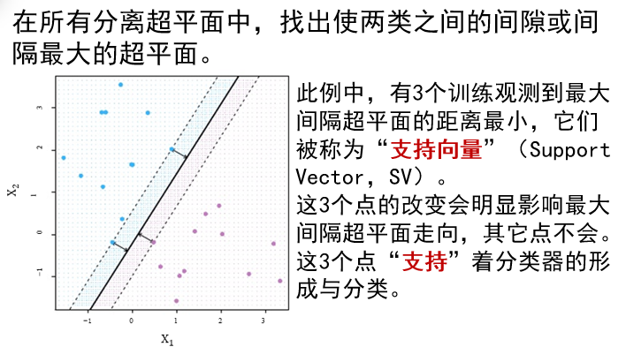

#### 支持向量


刚好落在间隔上和落在间隔错误一侧的观测叫做**支持向量**，只有这些观测会影响支持向量分类器

#### 支持向量分类器
只要求超平面几乎能够把类别区分开，即使用所谓的软间隔( soft
margin) 。**最大间隔分类器**在线性不可分情况
下的推广叫做支持向量分类器 (support vector classifier)。
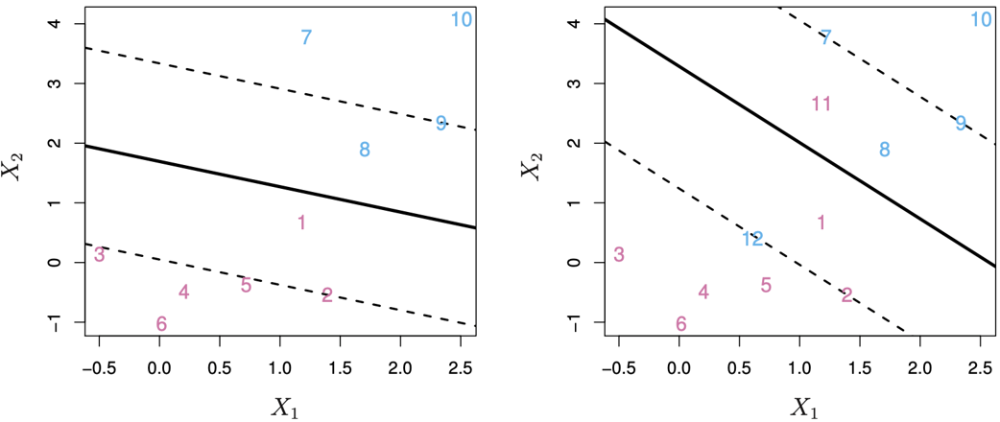
##### 软间隔范围限定
$$
y_i(β_0+β_1x_{i1}+β_2x_{i2}+...+β_1p_{ip})≥M(1-ε_i)
$$
$$
ε_i≥0,\sum_{i=1}^{n}ε_i≤C,\sum_{j=1}^{p}β_{j}^2=1
$$
怎么调整C限制𝜖𝑖,使得超平面虽被violated，但能在接受范围内?
𝜖𝑖：0，正确间隔；>0，错误间隔；>1(右式为负数)，错误超平面侧。


C：0，所有𝜖𝑖为0，不允许穿过间隔；>0，最多可以有C个观测落到超平面错误一侧，因为每个错误落侧都对应其𝜖𝑖>1(因为得为负)。至于穿过间隔多少个，无法说
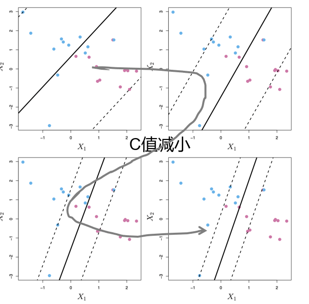

#### 非线性决策边界分类

如果预测变量和响应变量之间的关系是非线性的，可以使用预测变量的高阶多项式来扩大特征空间

比如可以使用2p个特征（多包含了二次项）来得到支持向量分类器：
$$
\mathop{maximize}\limits_{β_0,β_{11},β_{12}，...,β_{p1}，β_{p2},ε_1,ε_2,...,ε_n}M
$$
满足
$$
y_i(β_0+\sum_{j=1}^{p}β_{j1}x_{ij}\sum_{j=1}^{p}β_{j2}x_{ij}^2)≥M(1-ε_i)
$$

$$
ε_i≥0,\sum_{i=1}^{n}ε_i≤C,\sum_{j=1}^{p}\sum_{k=1}^{2}β_{jk}^2=1
$$
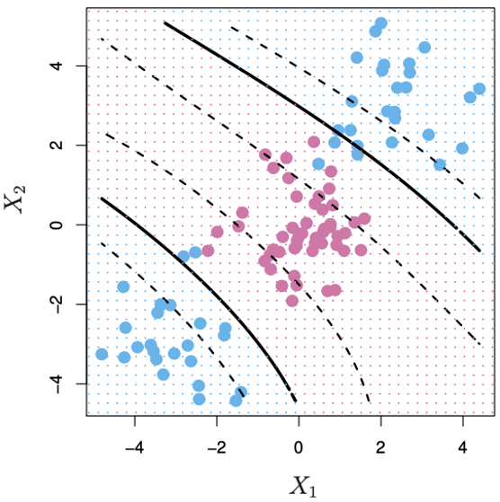
### 支持向量机

是支持向量分类器的一个扩展，使用**核函数**来扩大特征空间

内积：两个p维向量a和b的**内积**定义为
$$
<x_i,x_{i'}>=\sum_{j=1}^{p}x_{ij}x_{i'j}
$$

##### 线性支持向量分类器

线性支持向量分类器可以描述为
$$
f(x)=β_0+\sum_{i=1}^{n}α_i<x,x_i>
$$
式子有n个参数$α_i$，每个训练观测对应一个参数


为了估计$α_i$和$β_0$，只需要所有训练观测的$C_n^2$个成对组合的内积$<x_i,x_{i'}>$

注意：非支持向量的观测的$α_i$=0

用一种一般化的形式$K(x_i,x_{i'})$来代替内积，这里K是一个核函数，用来衡量观测之间相似性的函数

比如使用简单的核函数$K(x_i,x_{i'})=\sum_{j=1}^{p}x_{ij}x_{i'j}$（**线性核函数**），即此时核函数就是$x_i$和$x_{i'}$的内积

###### 核函数

核函数的主要作用是通过隐式映射将数据从原始的输入空间映射到一个更高维的特征空间，在高维空间中，数据可能变得线性可分，从而可以使用线性分类器解决原本的非线性问题。

##### 自由度为d的多项式核函数

$$
K(x_i,x_{i'})=(1+\sum_{j=1}^{p}x_{ij}x_{i'j})^d
$$

和标准的线性核函数相比，能生成光滑度更高的决策边界

支持向量分类器与这样的非线性核函数的结合，就是**支持向量机**

这种情况下非线性核函数的形式为$f(x)=β_0+\sum_{i∈S}α_iK(x,x_i)$

##### 径向核函数

$$
K(x_i,x_{i'})=exp(-γ\sum_{j=1}^{p}(x_{ij}-x_{i'j})^2)
$$

原理是以欧氏距离衡量，离测试观测远的训练观测的影响很小，某种意义上径向核函数是一种局部方法


##### 使用核函数的优势

计算量更小

- 核函数只需要为$C_n^2$个不同对配对$i,i'$计算$K(x_i,x_i')$
- 而在扩大的特征空间中没有明确的计算量


### 多分类的SVM(support vector machine)

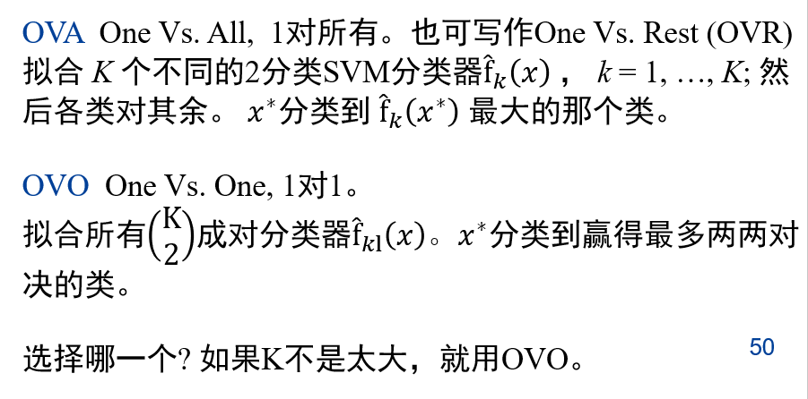
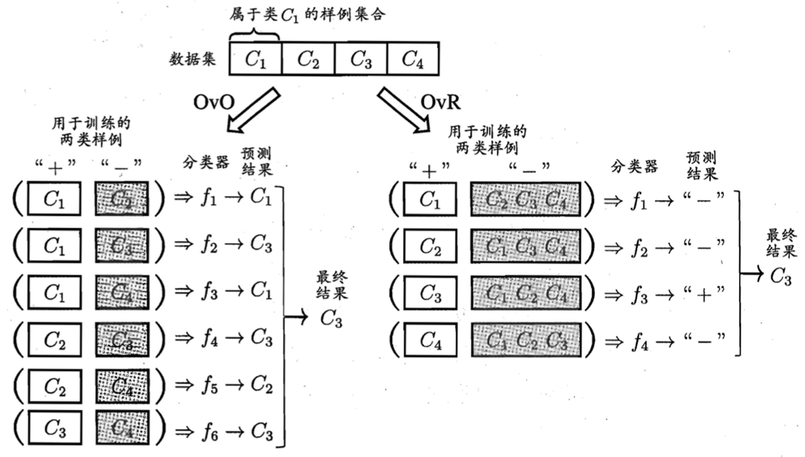


## 第十章 无监督学习
### 主成分分析 PCA
PCA产生一个对数据集的低维表示。它可以找到具有最大方差且互不相关的变量的线性组合序列。
#### 标准化
$$
𝑍_1=𝜙_{11} 𝑋_1+𝜙_{21} 𝑋_2+…+𝜙_{p1} 𝑋_𝑝
$$
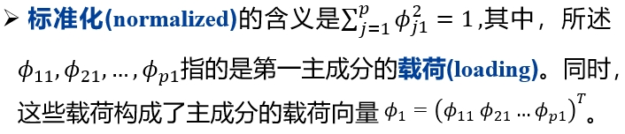
主成分受变量度量单位的选择影响，会导致结果的任意性。通常在进行PCA之前，需要将每个变量都标准化，使得它们的方差都为1。
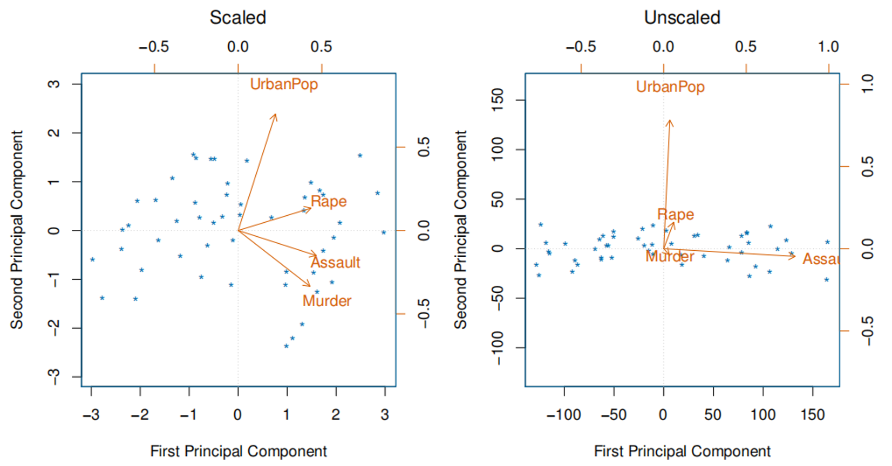
### 聚类分析法
聚类分析(clustering)是在一个数据集中寻找子群(subgroups)或类(clusters)的技术，应用非常广泛。

#### K均值聚类(K-means clustering)
试图将观测划分到事先规定数量的类中。
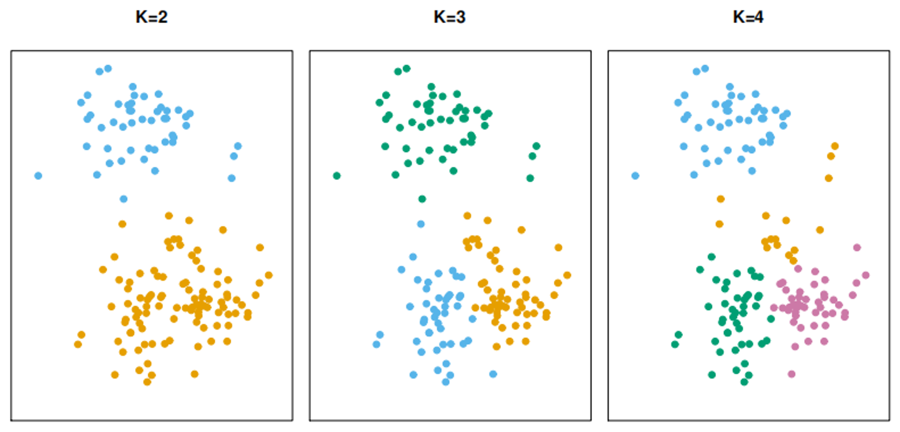
K均值聚类法的思想是，一个好的聚类法可以使类内差异(within-cluster variation)尽可能小。
算法
>1. 为每个观测随机分配一个从1到K的数字。这些数字可以看作对这些观测的初始类。
>2. 重复下列操作，直到类的分配停止为止：
>2.1 分别计算K个类的类中心。第k个类中心(centroid)是第k个类中的p维观测向量的均值向量。
>2.2 将每个观测分配到距离其最近的类中心所在的类中（用欧式距离定义“最近(closest)”）。

#### 系统聚类(hierarchical clustering)
并不需要事先规定所需的类数。我们最后会通过分析观测的树型表示，即谱系图(dendrogram)来确定类数。通过看谱系图还可以马上获得从1类到𝑛类类数不等的分类情况。

算法
>  从谱系图的底部开始，𝑛个观测各自都被看作一类
 再将两个最为相似的类汇合到一起，就得到了𝑛−1个类；
 然后再把两个最为相似的类汇合到一起，就得到了𝑛−2个类；
 如此进行下去，到所有观测都属于某一个类时停止

 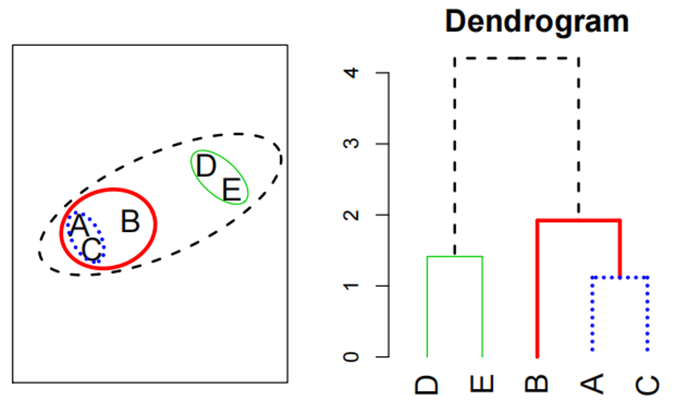


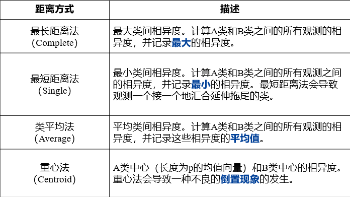


##  第十一章 各模型评测
###  各模型偏差-方差均衡以及光滑度-可解释性均衡


####  偏差-方差均衡

| 模型           | 偏差减小，方差增大 | 方差减小，偏差增大 |
| -------------- | ------------------ | ------------------ |
| 线性回归       | 系数个数增多       | 系数个数减少       |
| K最近邻（KNN） | K减小              | K增大              |
| 岭回归/Lasso   | λ减小              | λ增大              |
| 多项式回归     | 最高项次数增大     | 最高项次数减小     |
| 阶梯函数       | 分割点个数增多     | 分割点个数减少     |
| 回归样条       | 自由度增大         | 自由度减小         |
| 光滑样条       | λ减小              | λ增大              |
| 局部回归       | 比例s减小          | 比例s增大          |
| 广义可加模型   | --                 | --                 |
| 决策树         | α减小              | α增大              |
| 支持向量分类器 | C减小/cost值增大   | C增大/cost值减小   |


####  光滑度-可解释性均衡

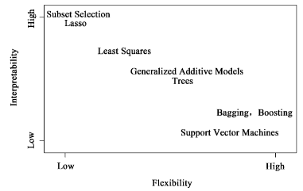

###  置信区间和预测区间的区别
区别

| **属性**              | **置信区间 (CI)**                               | **预测区间 (PI)**                           |
|-----------------------|-----------------------------------------------|-------------------------------------------|
| **目的**              | 估计**总体平均值**的范围                         | 估计**单个预测值**的范围                     |
| **包含内容**          | 仅包含模型的不确定性（标准误差 $SE$）            | 包含模型不确定性 + 数据固有波动（$\sigma$） |
| **区间宽度**          | 相对较窄                                      | 相对较宽                                  |
| **应用场景**          | 用于描述模型对总体均值预测的精度                  | 用于预测新数据点的可能范围                   |
| **解释方式**          | “在95%的置信水平下，真实的均值落在区间内。”         | “在95%的置信水平下，未来的某个值落在区间内。” |

---


常见的惩罚向
支持向量机(lamba=C,C越大，软间隔越大，方差越小，偏差增大)
Lasso(lamba增大，变量数量变少，系数减少，趋近于线性，方差减少，偏差增大)
岭回归(lamba增大，变量数量变少，系数减少，趋近于线性，方差减少，偏差增大)
光华样条(λ由0增至∞，实际自由度$df_{λ}$从n降至2,自由度降低，趋近于线性，方差减少，偏差增大)