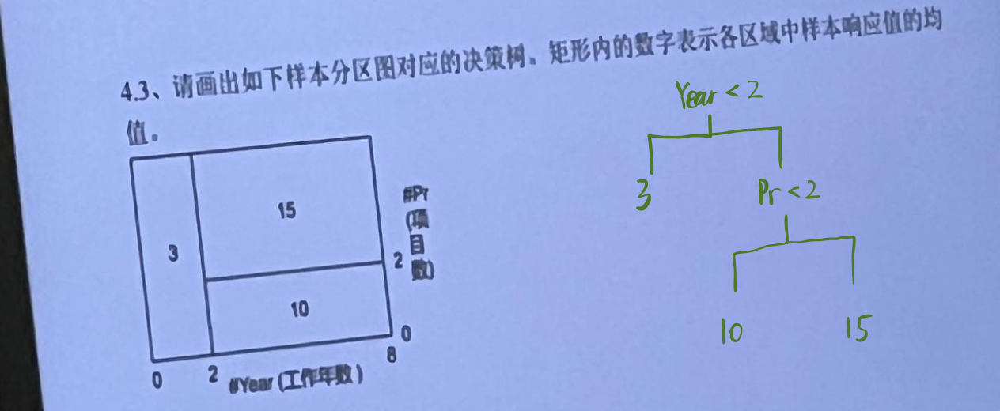

# 最小二乘法的最优子集选择法 - 优缺点
#### https://github.com/EternityQAQ2/DLUT_2024_GaoTong
## 优点

1. **提升模型的准确性**  
   - **选择重要变量**：最优子集法通过选择最相关的自变量来构建回归模型，避免了无关变量对模型性能的干扰，从而提高了模型的预测能力。
   - **避免过拟合**：通过选择合适的子集，去除冗余或不相关的变量，可以防止模型复杂度过高，从而减少过拟合现象。

2. **简化模型**  
   - **提高模型的可解释性**：通过选择少量重要的特征，简化了模型，使得模型更易于理解和解释。这对于一些需要解释变量作用的应用（如经济学、医学等）非常重要。
   - **减少多重共线性**：如果某些自变量之间存在高度相关性，最优子集法可以有效地选择去除冗余的变量，从而减少共线性问题，改善模型稳定性。

3. **灵活性强**  
   - **多种选择方法**：最优子集法提供了多种实现方式，如穷举法、前向选择、后向剔除和逐步选择，允许根据不同的需求和数据集选择最适合的算法。

4. **能够获得全局最优解（穷举法）**  
   - **穷举法**：在小规模数据集中，使用穷举法可以找到所有变量子集中的全局最优解，确保模型选择的是最好的自变量组合。

## 缺点

1. **计算开销大**  
   - **高计算复杂度**：穷举法的计算复杂度为 \(2^p\)，其中 \(p\) 是自变量的数量，这意味着当自变量数量很大时，穷举法的计算开销非常大。在变量很多的情况下，这种方法可能不切实际。
   - **高维数据的挑战**：随着特征数量的增加，计算量会迅速增加，尤其在高维数据集下，最优子集选择可能变得不可行。

2. **可能陷入局部最优解（逐步选择方法）**  
   - **前向选择和后向剔除的局限性**：逐步选择方法（如前向选择、后向剔除）并不能保证全局最优解，可能只找到局部最优解。例如，前向选择方法可能在开始时选择了一个次优的变量组合，进而影响后续的选择。
   - **需要多次尝试**：这些方法可能无法捕捉到变量之间的复杂相互作用，特别是对于非线性关系，可能导致子集选择的不足。

3. **可能过于依赖于数据**  
   - **数据的敏感性**：最优子集法的结果可能对训练数据非常敏感，尤其是在数据量较小或存在噪声的情况下。小的波动或噪声可能导致子集选择发生显著变化。
   - **不适应新数据**：如果训练数据与未来预测数据分布不同，选择的最优子集可能无法适应新数据，从而影响模型的泛化能力。

4. **可能忽略变量间的相互作用**  
   - **变量间交互作用的忽略**：最优子集选择方法通常独立地考虑每个变量，而忽略了变量之间的交互作用。在某些情况下，变量之间的交互作用对因变量的影响可能非常重要，而传统的最优子集选择方法可能无法捕捉到这一点。

5. **选择标准的依赖性**  
   - **选择标准影响结果**：最优子集选择方法的结果通常依赖于所使用的选择标准（如AIC、BIC、交叉验证等）。不同的标准可能导致选择的变量子集有所不同，因此需要谨慎选择标准。
   - **过度依赖统计量**：一些方法（如逐步选择）可能过度依赖某些统计量（如p值、AIC），忽略了模型的实际预测能力或泛化能力。

6. **不适用于非常大的数据集**  
   - **大数据挑战**：在特征非常多（例如几百到几千个自变量）的情况下，穷举法和其他逐步方法的计算成本非常高，可能无法在实际应用中使用。对于非常大的数据集，最优子集选择可能不可行。

## 总结

最优子集选择法是一种有效的回归分析方法，特别适用于变量选择和模型简化，但也存在一定的局限性。它的主要优点是能够提高模型的预测性能，简化模型并避免过拟合，但其缺点在于计算开销大、容易陷入局部最优解，并且对于高维数据和变量间的复杂相互作用较难处理。因此，在使用最优子集选择时，通常需要平衡计算复杂度和模型的实际需求，结合其他方法（如正则化、交叉验证等）来提高模型的效果和泛化能力。

# 带有惩罚因子的模型

在回归分析、分类和其他机器学习任务中，惩罚因子用于控制模型的复杂性，以避免过拟合。以下列出了四个带有惩罚因子的模型及其公式，并对每个模型的目的进行了简要解释。

## 1. Lasso 回归 (L1 正则化)

**Lasso 回归**通过对回归系数的 L1 范数（系数绝对值之和）进行惩罚，强制一些系数变为零，从而实现特征选择。

### 公式：
\[
\hat{\beta}^{lasso} = \underset{\beta}{\text{argmin}} \left( \sum_{i=1}^{n} (y_i - X_i \beta)^2 + \lambda \sum_{j=1}^{p} |\beta_j| \right)
\]
- **目标**：通过加入 L1 惩罚项，Lasso 回归会选择较少的特征并使得某些系数变为零，进而自动进行特征选择。
- **解释**：Lasso 回归适用于需要从多个特征中挑选出最重要特征的情况。

## 2. 岭回归 (L2 正则化)

**岭回归**通过对回归系数的 L2 范数（系数平方和）进行惩罚，约束模型参数的大小，避免模型过于复杂，防止过拟合。

### 公式：
\[
\hat{\beta}^{ridge} = \underset{\beta}{\text{argmin}} \left( \sum_{i=1}^{n} (y_i - X_i \beta)^2 + \lambda \sum_{j=1}^{p} \beta_j^2 \right)
\]
- **目标**：通过加入 L2 惩罚项，岭回归适用于处理多重共线性问题，同时防止过拟合。
- **解释**：岭回归适合于在特征数目很多或特征之间存在共线性的情况下使用。

## 3. 光滑样条 (Smooth Spline)

**光滑样条**通过使用样条函数的光滑度惩罚项来拟合数据。它允许模型在数据的不同部分保持一定的平滑性。

### 公式：
\[
\hat{f}(x) = \underset{f}{\text{argmin}} \left( \sum_{i=1}^{n} (y_i - f(x_i))^2 + \lambda \int \left( f''(x) \right)^2 \, dx \right)
\]
- **目标**：通过对二阶导数的惩罚，光滑样条保证了模型的平滑性，避免过拟合并使得拟合函数具有平滑的转折。
- **解释**：光滑样条主要用于平滑数据，适合于处理平滑函数估计的问题，特别是在处理非线性关系时。

## 总结

这些带有惩罚因子的模型通过不同方式对模型的复杂度进行控制，从而防止过拟合并提升模型的泛化能力：
- **Lasso 回归**：用于特征选择。
- **岭回归**：用于处理共线性问题并控制模型的复杂度。
- **光滑样条**：用于平滑数据，处理非线性关系。

